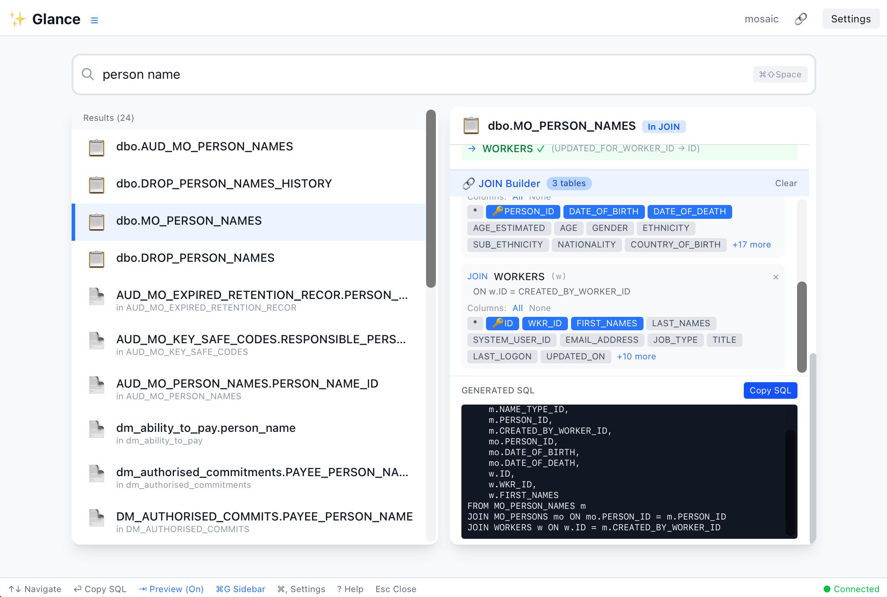

# ✨ Glance

**Fast database schema explorer with fuzzy search**

Glance is a cross-platform desktop application for exploring SQL Server database schemas. Find tables, columns, and relationships instantly with fuzzy search, and copy SQL queries with a single click.



## Features

### 🔍 Lightning-Fast Fuzzy Search
- Search across tables and columns simultaneously
- Fuzzy matching finds what you need even with typos
- Search by table name, column name, or data type
- Results ranked by relevance

### 📊 Schema Navigation
- Browse tables with their columns and relationships
- View primary keys, foreign keys, and data types
- Navigate relationships by clicking foreign key links
- Breadcrumb navigation for easy backtracking

### 🔗 JOIN Query Builder
- Build multi-table JOIN queries visually
- Automatic JOIN clause generation
- Select specific columns to include
- Copy complete SQL with one click

### ⚡ One-Click SQL Copying
- Click any table → copies `SELECT * FROM tablename`
- Click any column → copies `SELECT column FROM tablename`
- Configurable SQL format preferences

### 🎨 Modern UI
- Clean, responsive interface
- Dark mode support
- Keyboard shortcuts for power users
- Sidebar with groups and recent history

## Installation

### macOS
1. Download `Glance_x.x.x_aarch64.dmg` from [Releases](https://github.com/yourusername/glance/releases)
2. Open the DMG and drag Glance to Applications
3. Launch from Applications or Spotlight

### Windows
1. Download `Glance_x.x.x_x64-setup.exe` from [Releases](https://github.com/yourusername/glance/releases)
2. Run the installer
3. Launch from Start Menu

### Linux
1. Download `Glance_x.x.x_amd64.deb` or `.AppImage` from [Releases](https://github.com/yourusername/glance/releases)
2. Install with `sudo dpkg -i Glance_x.x.x_amd64.deb` or run the AppImage directly

## Getting Started

### 1. Connect to a Database
When you first open Glance, you'll see the connection form:

- **Connection Name**: A friendly name (e.g., "Production DB")
- **Server**: SQL Server hostname (e.g., `localhost\SQLEXPRESS`)
- **Database**: Database name
- **Authentication**: Choose SQL Server or Windows Authentication
- **Username/Password**: For SQL Server Authentication

Click **Test Connection** to verify, then **Save & Connect**.

### 2. Search for Tables and Columns
Once connected, Glance indexes your schema and you can start searching:

- Type any part of a table or column name
- Use `t:` prefix to search only tables (e.g., `t:user`)
- Use `c:` prefix to search only columns (e.g., `c:email`)
- Click a result to copy the SQL and view details

### 3. Navigate Relationships
When viewing a table:
- Click any foreign key to navigate to the related table
- Use the **← Back** button or breadcrumbs to return
- Build JOIN queries to combine multiple tables

### 4. Customize Settings
Press `Cmd/Ctrl + ,` to open Settings:
- **Theme**: Light, Dark, or System
- **Copy Behavior**: What happens when you click a result
- **Row Limit**: Default TOP N for queries

## Keyboard Shortcuts

| Shortcut | Action |
|----------|--------|
| `Cmd/Ctrl + K` | Focus search |
| `↑ / ↓` | Navigate results |
| `Enter` | Select result |
| `Tab` | Toggle preview panel |
| `Cmd/Ctrl + B` | Toggle sidebar |
| `Cmd/Ctrl + ,` | Open settings |
| `?` | Show help |
| `Esc` | Close modal / Clear search |

## Building from Source

### Prerequisites
- [Node.js](https://nodejs.org/) 18+
- [Rust](https://rustup.rs/) 1.70+
- [Tauri CLI](https://tauri.app/v1/guides/getting-started/prerequisites)

### Development
```bash
npm install
npm run tauri dev
```

### Production Build
```bash
npm run tauri build
```

Builds will be in `src-tauri/target/release/bundle/`.

## Tech Stack

- **Frontend**: React + TypeScript
- **Styling**: Tailwind CSS
- **State Management**: Zustand
- **Desktop Framework**: Tauri 2.0
- **Backend**: Rust
- **Database**: SQL Server (via Tiberius)
- **Search**: Fuse.js for fuzzy matching

## Configuration

Glance stores configuration in:
- **macOS**: `~/Library/Application Support/com.engleonglee.glance/`
- **Windows**: `%APPDATA%\com.engleonglee.glance\`
- **Linux**: `~/.config/com.engleonglee.glance/`

### Files
- `connections.json` - Saved database connections
- `schema_cache/` - Cached schema data for offline browsing
- `settings.json` - User preferences

## Contributing

Contributions are welcome! Please feel free to submit a Pull Request.

## License

MIT License - see [LICENSE](LICENSE) for details.

## Acknowledgments

- Built with [Tauri](https://tauri.app/)
- Fuzzy search powered by [Fuse.js](https://fusejs.io/)
- SQL Server connectivity via [Tiberius](https://github.com/prisma/tiberius)

---

Made with ❤️ by [Eng Leong Lee](https://github.com/engleonglee)
